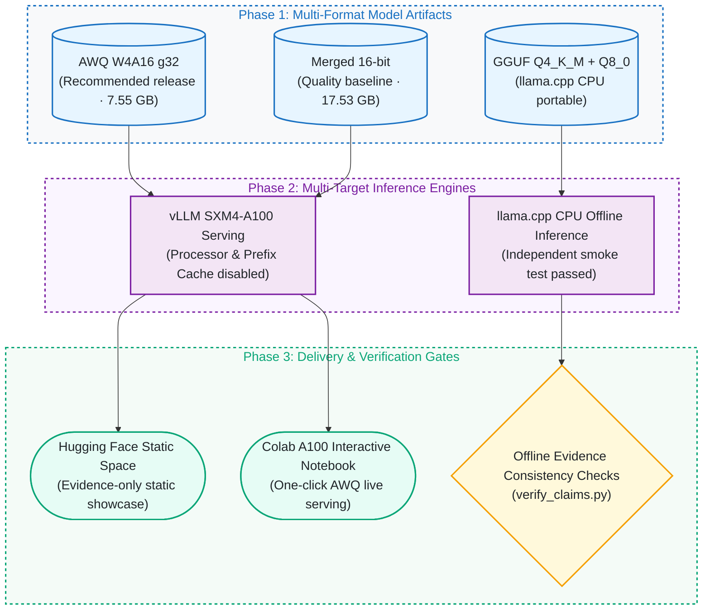

# Qwen3-VL ChartQA: QLoRA, AWQ Quantization, and vLLM Serving

[](https://github.com/kuotunyu/qwen3-vl-chartqa/actions/workflows/ci.yml)
[](https://github.com/kuotunyu/qwen3-vl-chartqa/releases/tag/v1.0.0)
[](https://github.com/kuotunyu/qwen3-vl-chartqa/releases/tag/v1.0.0)


[](LICENSE)

[繁體中文](README.md)

This project uses existing Qwen3-VL-8B-Instruct experiments to examine chart-understanding quality, quantization, and serving tradeoffs. Fine-tuning on 15,000 examples improved full-test accuracy by 0.56 pp; the separate merged/AWQ comparison lost 0.72 pp, within the 2 pp gate. On one A100, the controlled benchmark measured +83.2% throughput and -51.9% TPOT p95 at concurrency 1, with worse TTFT at higher concurrency. Each group contains only 64 requests, so p95 is exploratory.

### 30-Second Executive Summary

| Stage | Key Results | Engineering Controls & Artifacts |
|---|---|---|
| **QLoRA Fine-tuning** | Full 2,500-question ChartQA Test: **+0.56 pp** (84.68% → 85.24%) | 15k examples, full vision & language adaptation, LoRA + Merged 16-bit |
| **AWQ Quality Gate** | AWQ W4A16 quality drop of only **-0.72 pp**, passing predefined **-2.0 pp** gate | Model footprint reduced from 17.53 GB to 7.55 GB (**2.32× compression**, -56.9%) |
| **vLLM A100 Serving** | At concurrency 1: **+83.2%** throughput, **-51.9%** TPOT p95; TTFT p95 worsens at c=4/8/16 | Single A100, fixed versions, 64 requests × 64 output tokens per group; all 8 model/concurrency combinations succeeded; exploratory p95 |
| **Multi-Target Artifacts** | 4 published weight formats + Interactive Colab demo + Static Space | LoRA / Merged 16-bit / AWQ / GGUF (llama.cpp CPU verified) |
| **Offline Evidence Checks** | `python scripts/verify_claims.py` checks tables, correctness flags, and selected hash/publication rules | Passing establishes consistency under implemented checks; it does not establish every claim's truth or rerun inference/scoring |

---

## System Architecture & Pipeline

### 1. Vision-Language Model Lifecycle Pipeline


### 2. Multi-Target Serving Architecture



---

## Model artifacts

| Artifact | Purpose | Specifications & Hub Links |
|---|---|---|
| AWQ W4A16 g32 | Recommended release artifact (2.32× compression, high throughput) | [Hugging Face Weights](https://huggingface.co/steven0226/qwen3vl-8b-chartqa-awq) |
| Merged 16-bit | Quality baseline and full-precision reference | [Hugging Face Weights](https://huggingface.co/steven0226/qwen3vl-8b-chartqa-merged-16bit) |
| LoRA adapter | Training output and PEFT reuse | [Hugging Face Weights](https://huggingface.co/steven0226/qwen3vl-8b-chartqa-lora) |
| GGUF Q4_K_M + Q8_0 mmproj | Portable llama.cpp CPU artifact | [Hugging Face Weights](https://huggingface.co/steven0226/qwen3vl-8b-chartqa-gguf) |

Live Showcase: [Hugging Face Space Demo](https://huggingface.co/spaces/steven0226/qwen3vl-chartqa-demo)

---

## Results

These are historical experimental results. `scripts/verify_claims.py` recomputes accuracy from stored correctness flags in `assets/`, compares the tables below, and checks selected derived metrics. It does not generate predictions or rescore original answers, and not every evidence file has a recorded hash.

**85.24% and 86.24% have different sources:** the [fine-tuning evaluation](assets/eval/results.json) uses Unsloth/Transformers with a 4-bit base plus LoRA; the [quantization evaluation](assets/eval_quant/results.json) uses merged 16-bit in isolated vLLM. The corresponding notebooks specify the same short-answer instruction and a 32-token maximum, but different image processing, ordering, and inference stacks. The fine-tuning run lacks complete version and execution metadata. The 1.00 pp gap cannot be attributed to one factor or treated as a sequential improvement. Interpret **84.68→85.24** and **86.24→85.52** separately; see [setting provenance and unresolved details](docs/DESIGN_NOTES.md#evaluation-provenance-audit-2026-09-19).

### Fine-tuning effect

Paired evaluation on the complete 2,500-question ChartQA test set:

| Split | n | Base before | Fine-tuned after | Change |
|---|---:|---:|---:|---:|
| Human | 1,250 | 75.28% | 75.44% | +0.16 pp |
| Augmented | 1,250 | 94.08% | 95.04% | +0.96 pp |
| Overall | 2,500 | 84.68% | **85.24%** | **+0.56 pp** |

### Quantization quality gate

Merged 16-bit and AWQ evaluated in isolated vLLM subprocesses (predefined threshold: -2.0 pp):

| Split | n | Merged 16-bit | AWQ W4A16 g32 | Change |
|---|---:|---:|---:|---:|
| Human | 1,250 | 77.28% | 76.56% | -0.72 pp |
| Augmented | 1,250 | 95.20% | 94.48% | -0.72 pp |
| Overall | 2,500 | 86.24% | **85.52%** | **-0.72 pp — PASS** |

Historical documentation reports a paired bootstrap 95% CI of `[-1.40, -0.04] pp` for the overall AWQ change. The repository lacks that bootstrap's seed, resample count, and executable source; the offline verifier does not verify this interval. The recorded gate passes on the point estimate: a 0.72 pp drop ≤ 2.0 pp.

### Serving benchmark

Evaluated on one NVIDIA A100-SXM4-40GB with vLLM `0.25.1+cu129`, 64 measured requests per level, fixed 64-token decode; all 8 levels passed the validity gate:

Run `v2-aa4442870cfd` uses torch `2.11.0+cu129` and fixed model/dataset revisions. Each group forces 64 output tokens (ignoring EOS), which does not represent natural short-answer lengths. **With only 64 requests per group, p95 is exploratory** and does not establish performance on other hardware/versions or a production SLA. See the [original benchmark table](assets/bench/benchmark_table.md) and [design notes](docs/DESIGN_NOTES.md#serving-benchmark-design).

| Model | Concurrency | Output tok/s | TTFT p95 | TPOT p95 | E2E p95 |
|---|---:|---:|---:|---:|---:|
| Merged 16-bit | 1 | 67.29 | 160.76 ms | 13.43 ms/tok | 1,007.16 ms |
| AWQ W4A16 g32 | 1 | **123.24** | **154.81 ms** | **6.47 ms/tok** | **562.00 ms** |
| Merged 16-bit | 4 | 231.02 | **299.78 ms** | 15.04 ms/tok | 1,169.61 ms |
| AWQ W4A16 g32 | 4 | **356.95** | 326.64 ms | **9.11 ms/tok** | **776.13 ms** |
| Merged 16-bit | 8 | 387.58 | **473.68 ms** | 18.33 ms/tok | 1,426.90 ms |
| AWQ W4A16 g32 | 8 | **528.48** | 572.66 ms | **12.40 ms/tok** | **1,038.69 ms** |
| Merged 16-bit | 16 | 595.06 | **806.77 ms** | 24.14 ms/tok | 2,005.45 ms |
| AWQ W4A16 g32 | 16 | **701.90** | 958.28 ms | **19.93 ms/tok** | **1,612.51 ms** |


Under this controlled workload, compared with Merged 16-bit, AWQ:

- reduces weight files from 17.53 GB to 7.55 GB (`-56.9%`, 2.32× compression);
- improves output throughput by 83.2%, 54.5%, 36.4%, and 18.0% at concurrency 1/4/8/16;
- reduces TPOT p95 by 51.9%, 39.4%, 32.4%, and 17.4%;
- reduces E2E p95 by 44.2%, 33.6%, 27.2%, and 19.6%;
- trades higher TTFT p95 at concurrency 4/8/16 (+9.0%, +20.9%, +18.8%); acceptability depends on first-token latency requirements, and this test does not establish the cause.

### Success/failure case evidence gap

Public per-item files contain only `idx` and `correct` (plus `query_sha256` for fine-tuning), without predictions, answers, questions, or charts. Quantization files also lack query hashes; matching idx across the two evaluation orderings would be invalid. These files support correctness statistics, but cannot establish OCR, arithmetic, or legend-reading failure causes. This review neither selects illustrative charts as evidence nor restores removed content. Missing fields and a prospective selection rule are recorded in the [case-analysis boundary](docs/DESIGN_NOTES.md#case-analysis-boundary); the synthetic showcase chart is not a model success case.

---

## Method & Engineering Controls

- **QLoRA Fine-tuning:** 8-bit AdamW, peak learning rate `2e-4`, effective batch size 16 on A100 adapting vision and language modules. The [training log](assets/log_history.json) records 1 epoch, 938 steps, 3,579 seconds, and run-summary `train_loss=0.5907`; elapsed time and this loss alone do not demonstrate convergence or generalization.
- **AWQ W4A16:** 4-bit symmetric grouped weights (group size 32), 256 calibration samples, vision tower and `lm_head` in original precision.
- **GGUF Export:** `Q4_K_M` text model and `Q8_0` multimodal projector with independent CPU smoke test.
- **Strict Benchmark Controls:** Caches disabled, warmup/measured inputs isolated, single physical GPU bound.

---

## Reproduce

Prepare locked dependencies first (the initial installation may need network access):

```bash
uv sync --frozen --python 3.12
```

Once the environment is ready, verify offline without a GPU, weights, or dataset:

```bash
uv run --offline --no-sync python scripts/verify_claims.py
uv run --offline --no-sync python -m unittest discover -s tests -v
```

Verification covers implemented numerical checks and rules, not all prose claims, original prediction scoring, the bootstrap CI, or the authenticity of experimental provenance. The 2026-09-19 review checks local documentation/evidence; it does not rerun historical experiments.

---

## Data and licensing

- Code: [MIT License](LICENSE).
- Third-party notices and licenses: [THIRD_PARTY_NOTICES.md](THIRD_PARTY_NOTICES.md).
