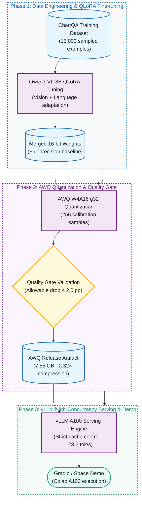

# Qwen3-VL ChartQA: QLoRA, AWQ Quantization, and vLLM Serving

[](https://github.com/kuotunyu/qwen3-vl-chartqa/actions/workflows/ci.yml)
[](https://github.com/kuotunyu/qwen3-vl-chartqa/releases/tag/v1.0.0)
[](https://huggingface.co/steven0226/qwen3vl-8b-chartqa-awq)
[](LICENSE)

[繁體中文](README.md)

For anyone who has to serve a vision-language model: this project measures what happens when the chart question-answering model Qwen3-VL-8B is squeezed to 4-bit — how much accuracy is lost, how much faster serving gets, and where the cost shows up.

> Quantizing a fine-tuned Qwen3-VL-8B to AWQ W4A16 shrinks the weights from 17.53 GB to 7.55 GB and costs 0.72 pp of ChartQA accuracy (86.24% → 85.52%, inside a 2 pp tolerance set beforehand). On one A100 it is 83.2% faster at concurrency 1, but TTFT p95 gets worse at concurrency 4/8/16. The 15,000-example QLoRA fine-tune itself barely moved accuracy (+0.56 pp).


## Key findings

- **Quantization costs almost no accuracy:** AWQ W4A16 shrinks the weights from 17.53 GB to 7.55 GB (2.32× compression), while accuracy on the full 2,500-question ChartQA test goes from 86.24% to 85.52% (-0.72 pp), inside the 2 pp tolerance set beforehand.
- **The speed benefit is concentrated at low concurrency:** on one A100, output throughput is +83.2% and TPOT p95 is -51.9% at concurrency 1, but first-token latency (TTFT p95) gets worse at concurrency 4/8/16 (middle panel above).
- **Fine-tuning brought almost no improvement (+0.56 pp; +0.16 pp on the human split):** after QLoRA fine-tuning on 15,000 examples, the same 2,500 questions go from 84.68% to 85.24%.
- All four weight formats (LoRA / Merged 16-bit / AWQ / GGUF) are public; the numbers in the tables on this page are checked against the result files in `assets/` by `scripts/verify_claims.py`, which CI runs every time.

**Links:** [Live showcase (Hugging Face Space, with a one-click Colab A100 notebook)](https://huggingface.co/spaces/steven0226/qwen3vl-chartqa-demo) · [AWQ weights](https://huggingface.co/steven0226/qwen3vl-8b-chartqa-awq) · other weights under [Model artifacts](#model-artifacts)

Check this page's numbers offline (no GPU, weights, or dataset; the initial dependency install may need network access):

```bash
uv sync --frozen --python 3.12
uv run --offline --no-sync python scripts/verify_claims.py
uv run --offline --no-sync python -m unittest discover -s tests -v
```

---

## How it works



How the published formats map onto vLLM, llama.cpp, and the showcase pages: see the [multi-target serving architecture diagram](docs/architecture.md#multi-target-serving-architecture).

---

## Results

These are historical experimental results; `scripts/verify_claims.py` recomputes accuracy from the stored per-item correctness flags in `assets/` and checks the three tables below plus the derived ratios.

### Quantization quality

Merged 16-bit and AWQ evaluated in isolated vLLM subprocesses on the full 2,500 questions (tolerance set beforehand: -2.0 pp):

| Split | n | Merged 16-bit | AWQ W4A16 g32 | Change |
|---|---:|---:|---:|---:|
| Human | 1,250 | 77.28% | 76.56% | -0.72 pp |
| Augmented | 1,250 | 95.20% | 94.48% | -0.72 pp |
| Overall | 2,500 | 86.24% | **85.52%** | **-0.72 pp — PASS** |

Weight files go from 17.53 GB to 7.55 GB (`-56.9%`, 2.32× compression). The quality threshold passes on the point estimate: a 0.72 pp drop ≤ 2.0 pp.

### Serving benchmark

Test conditions: one NVIDIA A100-SXM4-40GB, vLLM `0.25.1+cu129`, torch `2.11.0+cu129` (run `v2-aa4442870cfd`), fixed model/dataset revisions; 64 measured requests per concurrency level, each forced to 64 output tokens (ignoring EOS), which does not represent natural short-answer lengths. All 8 levels completed 64/64 and passed the validity checks. **With only 64 requests per group, p95 is exploratory** and does not establish performance on other hardware/versions or a production SLA.

| Model | Concurrency | Output tok/s | TTFT p95 | TPOT p95 | E2E p95 |
|---|---:|---:|---:|---:|---:|
| Merged 16-bit | 1 | 67.29 | 160.76 ms | 13.43 ms/tok | 1,007.16 ms |
| AWQ W4A16 g32 | 1 | **123.24** | **154.81 ms** | **6.47 ms/tok** | **562.00 ms** |
| Merged 16-bit | 4 | 231.02 | **299.78 ms** | 15.04 ms/tok | 1,169.61 ms |
| AWQ W4A16 g32 | 4 | **356.95** | 326.64 ms | **9.11 ms/tok** | **776.13 ms** |
| Merged 16-bit | 8 | 387.58 | **473.68 ms** | 18.33 ms/tok | 1,426.90 ms |
| AWQ W4A16 g32 | 8 | **528.48** | 572.66 ms | **12.40 ms/tok** | **1,038.69 ms** |
| Merged 16-bit | 16 | 595.06 | **806.77 ms** | 24.14 ms/tok | 2,005.45 ms |
| AWQ W4A16 g32 | 16 | **701.90** | 958.28 ms | **19.93 ms/tok** | **1,612.51 ms** |

Under this controlled workload, compared with Merged 16-bit, AWQ:

- improves output throughput by 83.2%, 54.5%, 36.4%, and 18.0% at concurrency 1/4/8/16;
- reduces TPOT p95 by 51.9%, 39.4%, 32.4%, and 17.4%, and E2E p95 by 44.2%, 33.6%, 27.2%, and 19.6%;
- pays for it with higher TTFT p95 at concurrency 4/8/16 (+9.0%, +20.9%, +18.8%); acceptability depends on first-token latency requirements, and this test does not establish the cause.

Full controls: [original benchmark table](assets/bench/benchmark_table.md) and [design notes](docs/DESIGN_NOTES.md#serving-benchmark-design).

### Fine-tuning effect

Paired evaluation on the complete 2,500-question ChartQA test set:

| Split | n | Base before | Fine-tuned after | Change |
|---|---:|---:|---:|---:|
| Human | 1,250 | 75.28% | 75.44% | +0.16 pp |
| Augmented | 1,250 | 94.08% | 95.04% | +0.96 pp |
| Overall | 2,500 | 84.68% | **85.24%** | **+0.56 pp** |

---

## Model artifacts

| Artifact | Purpose | Specifications & Hub Links |
|---|---|---|
| AWQ W4A16 g32 | Recommended release artifact (2.32× compression, high throughput) | [Hugging Face Weights](https://huggingface.co/steven0226/qwen3vl-8b-chartqa-awq) |
| Merged 16-bit | Quality baseline and full-precision reference | [Hugging Face Weights](https://huggingface.co/steven0226/qwen3vl-8b-chartqa-merged-16bit) |
| LoRA adapter | Training output and PEFT reuse | [Hugging Face Weights](https://huggingface.co/steven0226/qwen3vl-8b-chartqa-lora) |
| GGUF Q4_K_M + Q8_0 mmproj | Portable llama.cpp CPU artifact | [Hugging Face Weights](https://huggingface.co/steven0226/qwen3vl-8b-chartqa-gguf) |

---

## Scope and limitations

- **The two accuracy series cannot be chained:** 85.24% comes from the [fine-tuning evaluation](assets/eval/results.json) (Unsloth/Transformers with a 4-bit base plus LoRA); 86.24% comes from the [quantization evaluation](assets/eval_quant/results.json) (merged 16-bit in isolated vLLM). The corresponding notebooks specify the same short-answer instruction and a 32-token maximum, but different image processing, ordering, and inference stacks, and the fine-tuning run lacks complete version and execution metadata. The 1.00 pp gap cannot be attributed to one factor or treated as a sequential improvement. Interpret **84.68→85.24** and **86.24→85.52** separately; see [setting provenance and unresolved details](docs/DESIGN_NOTES.md#evaluation-provenance-audit-2026-09-19).
- **The bootstrap interval cannot be reproduced:** historical documentation reports a paired bootstrap 95% CI of `[-1.40, -0.04] pp` for the overall AWQ change, but the repository lacks that bootstrap's seed, resample count, and executable source; the offline check does not verify this interval.
- **No per-item failure analysis is possible:** public per-item files contain only `idx` and `correct` (plus `query_sha256` for fine-tuning), without predictions, answers, questions, or charts. Quantization files also lack query hashes, so matching idx across the two evaluation orderings would be invalid. The files support correctness statistics but cannot establish OCR, arithmetic, or legend-reading failure causes; no illustrative charts are selected as evidence, and the synthetic showcase chart is not a model success case. Missing fields and a prospective selection rule are recorded in the [case-analysis boundary](docs/DESIGN_NOTES.md#case-analysis-boundary).
- **What the offline check covers:** passing `verify_claims.py` establishes consistency under the implemented checks. It does not generate predictions, rescore original answers, or cover all prose claims or the authenticity of experimental provenance, and not every evidence file has a recorded hash. The 2026-09-19 review checked local documentation/evidence; it did not rerun historical experiments.
- **Training log:** elapsed time and `train_loss` alone do not demonstrate convergence or generalization.

---

## Method & Engineering Controls

- **QLoRA Fine-tuning:** 8-bit AdamW, peak learning rate `2e-4`, effective batch size 16 on A100 adapting vision and language modules. The [training log](assets/log_history.json) records 1 epoch, 938 steps, 3,579 seconds, and run-summary `train_loss=0.5907`.
- **AWQ W4A16:** 4-bit symmetric grouped weights (group size 32), 256 calibration samples, vision tower and `lm_head` in original precision.
- **GGUF Export:** `Q4_K_M` text model and `Q8_0` multimodal projector with independent CPU smoke test.
- **Benchmark Controls:** Processor/prefix caches disabled, warmup/measured inputs isolated, single physical GPU bound; a measurement with a JIT warning inside the measured window is rejected.

---

## Data and licensing

- Code: [MIT License](LICENSE).
- Third-party notices and licenses: [THIRD_PARTY_NOTICES.md](THIRD_PARTY_NOTICES.md).

## Further reading

- [Design notes: decisions, evaluation provenance audit, benchmark design, and Q&A](docs/DESIGN_NOTES.md)
- [Multi-target serving architecture diagram](docs/architecture.md#multi-target-serving-architecture)
- [Original benchmark table](assets/bench/benchmark_table.md)
- Model cards: [AWQ](docs/model_cards/awq.md) · [Merged 16-bit](docs/model_cards/merged-16bit.md) · [LoRA](docs/model_cards/lora.md) · [GGUF](docs/model_cards/gguf.md)
