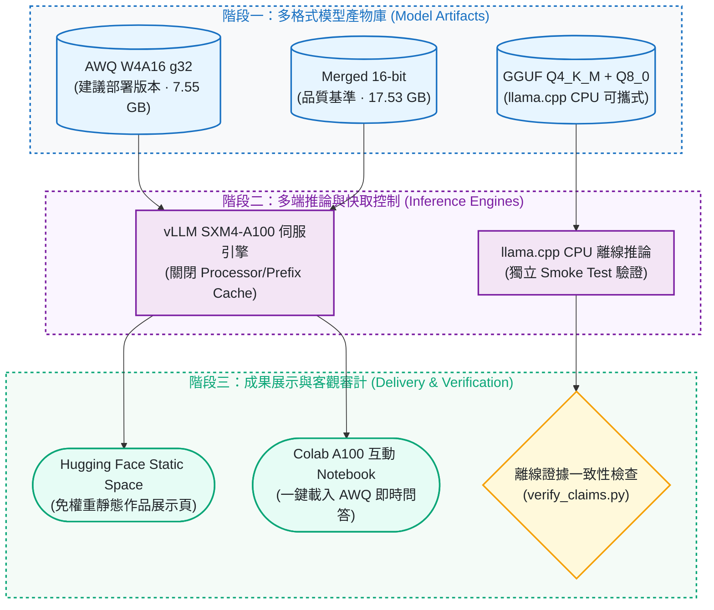

# Qwen3-VL ChartQA：QLoRA 微調、AWQ 量化與 vLLM 部署

[](https://github.com/kuotunyu/qwen3-vl-chartqa/actions/workflows/ci.yml)
[](https://github.com/kuotunyu/qwen3-vl-chartqa/releases/tag/v1.0.0)
[](https://github.com/kuotunyu/qwen3-vl-chartqa/releases/tag/v1.0.0)


[](LICENSE)

[English](README.en.md)

本專案以既有 Qwen3-VL-8B-Instruct 實驗呈現圖表理解的品質、量化與部署取捨：15,000 筆資料微調後，完整 2,500 題 Test 準確率增加 0.56 pp；獨立的 merged/AWQ 比較下降 0.72 pp，通過 2 pp 品質門檻。單張 A100 的固定負載 benchmark 在 concurrency 1 測得吞吐量提升 83.2%、TPOT p95 降低 51.9%；高併發 TTFT 則退步。每組僅 64 requests，p95 為探索性結果。

### 30 秒快速摘要 (Executive Summary)

| 階段 (Stage) | 核心指標與成果 (Key Result) | 工程控制與產物 (Controls & Artifacts) |
|---|---|---|
| **QLoRA 微調** | 完整 2,500 題 ChartQA Test：**+0.56 pp**（84.68% → 85.24%） | 15,000 樣本、全適配 Vision/Language，生成 LoRA 與 Merged 16-bit 權重 |
| **AWQ 量化門禁** | AWQ W4A16 僅下降 **-0.72 pp**，通過預設 **-2.0 pp** 嚴格品質門檻 | 權重由 17.53 GB 降至 7.55 GB（**2.32× 壓縮**，減少 56.9%） |
| **vLLM A100 部署** | concurrency 1：吞吐量 **+83.2%**、TPOT p95 **-51.9%**；c=4/8/16 的 TTFT p95 退步 | 單張 A100、固定版本、每組 64 requests × 64 output tokens；8 組模型／併發組合全成功，p95 僅供探索 |
| **多格式產物庫** | 公開 4 種權重格式 + 靜態展示頁 + Colab A100 互動環境 | LoRA / Merged 16-bit / AWQ / GGUF（llama.cpp CPU 驗證） |
| **離線證據檢查** | `python scripts/verify_claims.py` 核對表格、正誤旗標與部分 hash／發布規則 | 通過代表已實作檢查的一致性，不證明所有宣稱真實，也不等同重跑模型或重新評分 |

---

## 系統架構與 Pipeline

### 1. 視覺語言模型端到端生命週期 Pipeline


### 2. 服務部署與多端推論架構



---

## 模型產物

| 產物 | 用途 | 規格與權重連結 |
|---|---|---|
| AWQ W4A16 g32 | 建議部署版本（2.32× 壓縮、高吞吐） | [Hugging Face 權重](https://huggingface.co/steven0226/qwen3vl-8b-chartqa-awq) |
| Merged 16-bit | 品質參考與 full-precision baseline | [Hugging Face 權重](https://huggingface.co/steven0226/qwen3vl-8b-chartqa-merged-16bit) |
| LoRA adapter | 訓練權重與 PEFT 模組 | [Hugging Face 權重](https://huggingface.co/steven0226/qwen3vl-8b-chartqa-lora) |
| GGUF Q4_K_M + Q8_0 mmproj | llama.cpp CPU 可攜式推論產物 | [Hugging Face 權重](https://huggingface.co/steven0226/qwen3vl-8b-chartqa-gguf) |

線上展示：[Hugging Face Space 作品頁](https://huggingface.co/spaces/steven0226/qwen3vl-chartqa-demo)（支援 Colab A100 一鍵啟動）

---

## 正式評測結果

以下為歷史實驗結果。`python scripts/verify_claims.py` 可由 `assets/` 的已存正誤旗標重算準確率、核對下列表格及部分衍生指標；它不重新產生預測或從原始答案重新評分，且不是每個證據檔都有已記錄的 hash。

**85.24% 與 86.24% 的來源不同：** 前者來自 [微調評測](assets/eval/results.json) 的 Unsloth／Transformers 4-bit base + LoRA；後者來自 [量化評測](assets/eval_quant/results.json) 的 merged 16-bit／獨立 vLLM。對應 notebook 顯示兩者使用相同短答指令、最多 32 tokens，但影像處理、題目排序及推論堆疊不同。微調 run 未完整保存版本與執行設定，不能把兩者的 1.00 pp 差距歸因於某一因素，也不能串成連續提升。分別解讀 **84.68→85.24** 與 **86.24→85.52**；詳見 [設定來源與未確認項目](docs/DESIGN_NOTES.md#evaluation-provenance-audit-2026-09-19)。

### 微調前後

完整 2,500 題 ChartQA test set 配對評估：

| Split | n | 微調前 | 微調後 | 變化 |
|---|---:|---:|---:|---:|
| Human | 1,250 | 75.28% | 75.44% | +0.16 pp |
| Augmented | 1,250 | 94.08% | 95.04% | +0.96 pp |
| Overall | 2,500 | 84.68% | **85.24%** | **+0.56 pp** |

### 量化品質門檻

Merged 16-bit 與 AWQ 於隔離 vLLM 程序中進行 2,500 題完整配對評估（預設容許上限：-2.0 pp）：

| Split | n | Merged 16-bit | AWQ W4A16 g32 | 變化 |
|---|---:|---:|---:|---:|
| Human | 1,250 | 77.28% | 76.56% | -0.72 pp |
| Augmented | 1,250 | 95.20% | 94.48% | -0.72 pp |
| Overall | 2,500 | 86.24% | **85.52%** | **-0.72 pp — PASS** |

歷史文件報告整體 AWQ 變化的 paired bootstrap 95% CI 為 `[-1.40, -0.04] pp`。目前 repo 缺少該次 bootstrap 的 seed、重抽次數及可執行來源，離線 verifier 不驗證此區間。已存品質門檻是依點估計下降 0.72 pp ≤ 2.0 pp 判定通過。

### Serving benchmark

基準測試環境為單張 NVIDIA A100-SXM4-40GB、vLLM `0.25.1+cu129`；各 level 包含 64 筆正式請求與固定 64 tokens 解碼，8 組測試全部 64/64 成功並通過 validity gate：

Run `v2-aa4442870cfd` 使用 torch `2.11.0+cu129`、固定模型／資料版本；每組強制 64 output tokens（忽略 EOS），不代表自然短答長度。**每組只有 64 requests，p95 為探索性指標**，不能推廣為其他硬體、版本或正式服務 SLA。完整控制與限制見 [benchmark 原表](assets/bench/benchmark_table.md) 及 [設計紀錄](docs/DESIGN_NOTES.md#serving-benchmark-design)。

| 模型 | Concurrency | Output tok/s | TTFT p95 | TPOT p95 | E2E p95 |
|---|---:|---:|---:|---:|---:|
| Merged 16-bit | 1 | 67.29 | 160.76 ms | 13.43 ms/tok | 1,007.16 ms |
| AWQ W4A16 g32 | 1 | **123.24** | **154.81 ms** | **6.47 ms/tok** | **562.00 ms** |
| Merged 16-bit | 4 | 231.02 | **299.78 ms** | 15.04 ms/tok | 1,169.61 ms |
| AWQ W4A16 g32 | 4 | **356.95** | 326.64 ms | **9.11 ms/tok** | **776.13 ms** |
| Merged 16-bit | 8 | 387.58 | **473.68 ms** | 18.33 ms/tok | 1,426.90 ms |
| AWQ W4A16 g32 | 8 | **528.48** | 572.66 ms | **12.40 ms/tok** | **1,038.69 ms** |
| Merged 16-bit | 16 | 595.06 | **806.77 ms** | 24.14 ms/tok | 2,005.45 ms |
| AWQ W4A16 g32 | 16 | **701.90** | 958.28 ms | **19.93 ms/tok** | **1,612.51 ms** |


在這次固定負載下，相較於 Merged 16-bit，AWQ 的取捨為：

- 權重檔由 17.53 GB 降至 7.55 GB，減少 56.9%（2.32× 壓縮）；
- 在 concurrency 1/4/8/16 的輸出吞吐量分別提升 83.2%／54.5%／36.4%／18.0%；
- TPOT p95 分別降低 51.9%／39.4%／32.4%／17.4%；
- E2E p95 分別降低 44.2%／33.6%／27.2%／19.6%；
- 高併發 TTFT p95（c=4/8/16）增加 9.0%／20.9%／18.8%；是否可接受取決於首 token 延遲需求，本測試未證實退步的原因。

### 成功／失敗案例的證據缺口

公開逐題檔只含 `idx`、`correct`（微調組另含 `query_sha256`），沒有預測、答案、題目或圖表；量化組也沒有 query hash，不能直接用相同 idx 跨兩種評測排序配對。因此目前只能重算正誤統計，無法可追溯地判斷 OCR、算術或圖例理解等失敗原因。這次不挑圖代替分析、不還原或發布已移除內容。缺少的欄位與未來選例規則記在 [案例分析邊界](docs/DESIGN_NOTES.md#case-analysis-boundary)；自製合成展示圖不算模型成功案例。

---

## 方法與工程控制

- **QLoRA 微調：** 使用 8-bit AdamW、peak lr `2e-4`、effective batch size 16，在 A100 上對 Qwen3-VL-8B 視覺與語言模組進行全適配微調。[訓練紀錄](assets/log_history.json) 顯示 1 epoch、938 steps、3,579 秒，run 摘要 `train_loss=0.5907`；耗時與此 loss 不足單獨證明收斂或泛化。
- **AWQ W4A16 量化：** group size 32，使用 256 筆校準樣本，保留 vision tower 與 `lm_head` 原始精度。
- **GGUF 匯出：** 生成 `Q4_K_M` 文字模型與 `Q8_0` 多模態 projector，通過獨立 CPU smoke test。
- **嚴格 Benchmark 控制：** 關閉快顯緩存、嚴格分離 warmup/measured 圖片、綁定單一物理 GPU，量測期若有 JIT 立即駁回。

---

## 驗證與重現

先準備鎖定依賴（首次安裝可能需要網路）：

```bash
uv sync --frozen --python 3.12
```

環境就緒後，離線驗證不需 GPU、權重或資料集：

```bash
uv run --offline --no-sync python scripts/verify_claims.py
uv run --offline --no-sync python -m unittest discover -s tests -v
```

驗證涵蓋程式內已列出的數值與規則，不涵蓋全部文字宣稱、原始預測評分、bootstrap CI 或實驗來源真實性。2026-09-19 的工作是離線文件／證據查核，未重跑歷史實驗。

---

## 資料與授權

- 本專案程式碼採 [MIT License](LICENSE) 授權。
- 第三方元件與資料集授權詳見 [THIRD_PARTY_NOTICES.md](THIRD_PARTY_NOTICES.md)。
