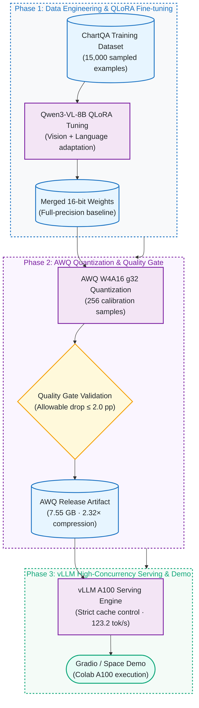
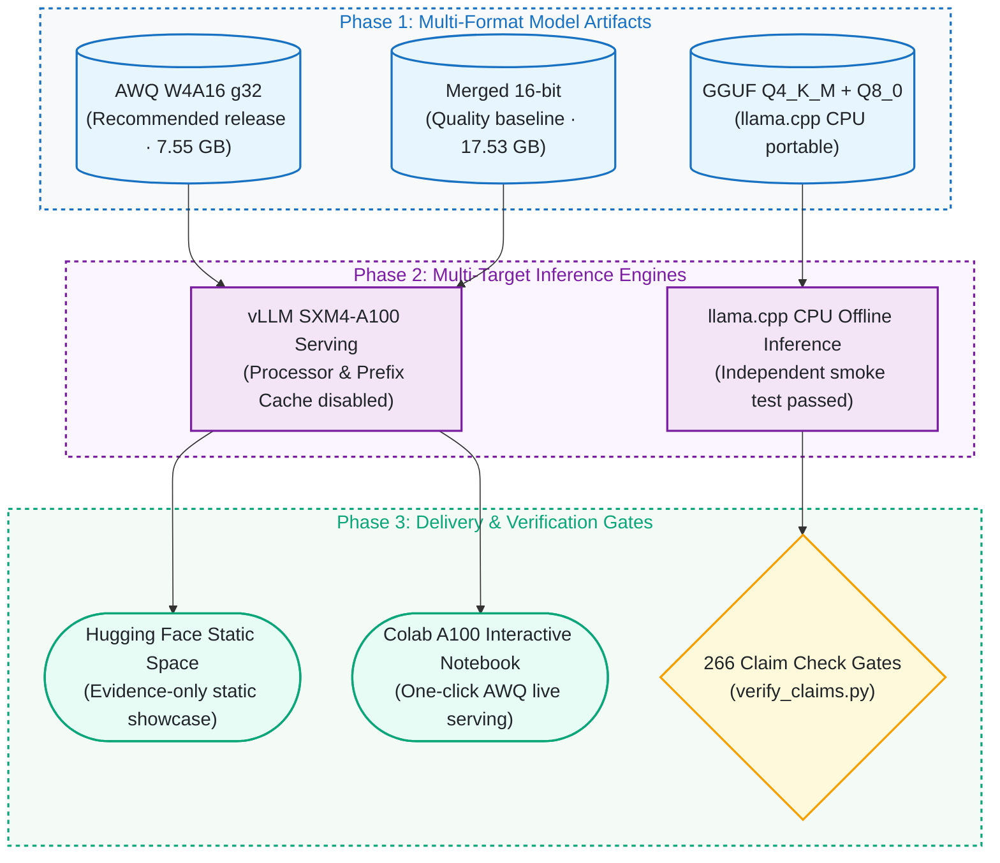

# Qwen3-VL ChartQA: QLoRA, AWQ Quantization, and vLLM Serving

[](https://github.com/kuotunyu/qwen3-vl-chartqa/actions/workflows/ci.yml)


[](LICENSE)

[繁體中文](README.zh-TW.md) · [→ Interactive Space](https://huggingface.co/spaces/steven0226/qwen3vl-chartqa-demo) · [→ Model Weights](https://huggingface.co/steven0226/qwen3vl-8b-chartqa-awq) · [→ Reproduce](#reproduce) · [→ Design Notes](docs/DESIGN_NOTES.md)

An end-to-end vision-language model project for chart question answering:

`ChartQA data → QLoRA fine-tuning → paired accuracy evaluation → 16-bit merge → AWQ W4A16 quantization → vLLM serving benchmark → Gradio demo`

The project fine-tunes Qwen3-VL-8B-Instruct on 15,000 ChartQA examples, validates the quantized model on the complete 2,500-question test set, and benchmarks the merged and AWQ models on the same A100 GPU with a cache-controlled multimodal workload.

---

## System Architecture & Pipeline

### 1. Vision-Language Model Lifecycle Pipeline



### 2. Multi-Target Serving Architecture



---

## Status

The planned scope is complete and feature-frozen. Training, evaluation, quantization, the serving benchmark and publishing all ran once, under pinned revisions, and are archived as machine-readable evidence.

- **Recommended serving artifact:** [AWQ W4A16 g32](https://huggingface.co/steven0226/qwen3vl-8b-chartqa-awq) — passes the quality gate, 2.32× smaller, faster at every tested concurrency.
- **Interactive demo:** the Colab A100 notebook, reached in one click from the [Static Space portfolio](https://huggingface.co/spaces/steven0226/qwen3vl-chartqa-demo). The Static Space presents evidence only; it does not run an 8B model in the browser.
- **Demo verification:** on 2026-07-16 a fresh Colab session served the pinned AWQ revision and answered a raw, unannotated ChartQA chart correctly in both short-answer and explanatory modes.
- **GGUF:** the `Q4_K_M` model and `Q8_0` multimodal projector are pinned at revision `5e5860f5d406` and passed an independent CPU smoke test.
- **Not deployed:** `space/` contains a complete, unit-tested CPU inference service (bounded queue, rate limiting, health/readiness, metrics). Hosting a Gradio or Docker Space on `cpu-basic` requires a paid Hugging Face plan, so it was never launched and **no OOD or soak result is claimed**. See [DESIGN_NOTES.md](docs/DESIGN_NOTES.md#archived-cpu-inference-service-built-tested-never-deployed).

This repository does not redistribute ChartQA. See [Data and licensing](#data-and-licensing).

---

## Model artifacts

| Artifact | Purpose | Hugging Face |
|---|---|---|
| LoRA adapter | Training output and PEFT reuse | [qwen3vl-8b-chartqa-lora](https://huggingface.co/steven0226/qwen3vl-8b-chartqa-lora) |
| Merged 16-bit | Quality reference and full-precision serving baseline | [qwen3vl-8b-chartqa-merged-16bit](https://huggingface.co/steven0226/qwen3vl-8b-chartqa-merged-16bit) |
| AWQ W4A16 g32 | Recommended deployment artifact | [qwen3vl-8b-chartqa-awq](https://huggingface.co/steven0226/qwen3vl-8b-chartqa-awq) |
| GGUF Q4_K_M + Q8_0 mmproj | Portable llama.cpp CPU artifact; smoke verified | [qwen3vl-8b-chartqa-gguf](https://huggingface.co/steven0226/qwen3vl-8b-chartqa-gguf) |

Persistent project showcase: [Qwen3-VL ChartQA｜圖表理解工作台](https://huggingface.co/spaces/steven0226/qwen3vl-chartqa-demo)

---

## Results

Every number below is recomputed from the evidence in `assets/` on each CI run:

```bash
python scripts/verify_claims.py
```

It parses the tables in both READMEs, recomputes each accuracy from per-item correctness, re-derives the compression and latency deltas from the benchmark JSON, re-checks the evidence SHA-256 chain, and fails if anything drifts.

| Claim | Evidence |
|---|---|
| Fine-tuning accuracy | [`assets/eval/results.json`](assets/eval/results.json), [`per_item_baseline.json`](assets/eval/per_item_baseline.json), [`per_item_finetuned.json`](assets/eval/per_item_finetuned.json) |
| Quantization quality gate | [`assets/eval_quant/results.json`](assets/eval_quant/results.json), [`per_item_merged16_n1250.json`](assets/eval_quant/per_item_merged16_n1250.json), [`per_item_awq_n1250.json`](assets/eval_quant/per_item_awq_n1250.json) |
| Serving benchmark | [`assets/bench/benchmark_results.json`](assets/bench/benchmark_results.json), [`workload_manifest.json`](assets/bench/workload_manifest.json), [`quality_gate_source.json`](assets/bench/quality_gate_source.json) |
| Quantization recipe | [`assets/quantization_metadata.json`](assets/quantization_metadata.json), [`assets/recipe.yaml`](assets/recipe.yaml) |
| Training run | [`assets/log_history.json`](assets/log_history.json), [`assets/loss_curve.png`](assets/loss_curve.png) |

### Fine-tuning effect

Paired evaluation on the complete ChartQA test set using the same evaluation recipe within this run:

| Split | n | Base before | Fine-tuned after | Change |
|---|---:|---:|---:|---:|
| Human | 1,250 | 75.28% | 75.44% | +0.16 pp |
| Augmented | 1,250 | 94.08% | 95.04% | +0.96 pp |
| Overall | 2,500 | 84.68% | **85.24%** | **+0.56 pp** |

### Quantization quality gate

The merged and AWQ artifacts were evaluated again in isolated vLLM subprocesses. The allowed degradation was 2 percentage points.

| Split | n | Merged 16-bit | AWQ W4A16 g32 | Change |
|---|---:|---:|---:|---:|
| Human | 1,250 | 77.28% | 76.56% | -0.72 pp |
| Augmented | 1,250 | 95.20% | 94.48% | -0.72 pp |
| Overall | 2,500 | 86.24% | **85.52%** | **-0.72 pp — PASS** |

The paired bootstrap 95% confidence interval for the overall AWQ change was `[-1.40, -0.04] pp`. The worst endpoint remained inside the predefined -2 pp gate.

The two accuracy tables use different paired evaluation stacks and should only be compared within each table. They are not intended as a cross-table ranking.

### Serving benchmark

Run `v2-aa4442870cfd` used one NVIDIA A100-SXM4-40GB, vLLM `0.25.1+cu129`, 64 measured requests per level, and a fixed 64-token decode. All 8 levels completed 64/64 requests with zero failures and passed the reporting validity gate.

| Model | Concurrency | Output tok/s | TTFT p95 | TPOT p95 | E2E p95 |
|---|---:|---:|---:|---:|---:|
| Merged 16-bit | 1 | 67.29 | 160.76 ms | 13.43 ms/tok | 1,007.16 ms |
| AWQ W4A16 g32 | 1 | **123.24** | **154.81 ms** | **6.47 ms/tok** | **562.00 ms** |
| Merged 16-bit | 4 | 231.02 | **299.78 ms** | 15.04 ms/tok | 1,169.61 ms |
| AWQ W4A16 g32 | 4 | **356.95** | 326.64 ms | **9.11 ms/tok** | **776.13 ms** |
| Merged 16-bit | 8 | 387.58 | **473.68 ms** | 18.33 ms/tok | 1,426.90 ms |
| AWQ W4A16 g32 | 8 | **528.48** | 572.66 ms | **12.40 ms/tok** | **1,038.69 ms** |
| Merged 16-bit | 16 | 595.06 | **806.77 ms** | 24.14 ms/tok | 2,005.45 ms |
| AWQ W4A16 g32 | 16 | **701.90** | 958.28 ms | **19.93 ms/tok** | **1,612.51 ms** |


Compared with merged 16-bit, AWQ:

- reduces weight files from 17.53 GB to 7.55 GB (`-56.9%`, 2.32× compression);
- improves output throughput by 83.2%, 54.5%, 36.4%, and 18.0% at concurrency 1/4/8/16;
- reduces TPOT p95 by 51.9%, 39.4%, 32.4%, and 17.4%;
- reduces E2E p95 by 44.2%, 33.6%, 27.2%, and 19.6%;
- trades higher TTFT p95 at concurrency 4/8/16 (+9.0%, +20.9%, +18.8%).

For this workload, concurrency 4 is a responsive multi-user setting, concurrency 8 is a practical throughput/latency balance, and concurrency 16 is appropriate only when aggregate throughput matters more than tail latency.

---

## Method

### Fine-tuning

- Base: `unsloth/Qwen3-VL-8B-Instruct-unsloth-bnb-4bit`
- Data: 15,000 shuffled ChartQA training examples
- Epochs: 1; max sequence length: 2,048
- LoRA: rank 16, alpha 16, dropout 0
- Effective batch size: 16 on A100 (4 × 4 gradient accumulation)
- Optimizer: 8-bit AdamW; peak learning rate `2e-4`; linear schedule
- Vision, language, attention, and MLP modules were enabled for LoRA adaptation
- Runtime: 3,579 seconds; final training loss: 0.5907

### Quantization

- AWQ / compressed-tensors W4A16
- 4-bit symmetric grouped weights; group size 32
- 256 ChartQA calibration examples; maximum calibration length 2,048
- Vision tower and `lm_head` retained at their original precision
- Formal quantization ran on an A100-SXM4-40GB with `SMOKE_TEST=false`

### GGUF export

- Revision: `5e5860f5d4060f87614ecfb6243a001067979276`
- Text model: `Qwen3VL-8B-ChartQA-Q4_K_M.gguf` (`5,027,784,800` bytes)
- Multimodal projector: `mmproj-Qwen3VL-8B-ChartQA-Q8_0.gguf` (`752,289,728` bytes)
- Pinned llama.cpp conversion plus an independent raw ChartQA CPU smoke test; expected and generated answer: `96`

### Benchmark controls

- Same 32 human + 32 augmented source cohort at all concurrency levels
- Same prompts and image dimensions across levels
- Separate measured/warm image variants; all 512 encoded and decoded-pixel hashes unique
- Multimodal processor cache and prefix cache disabled
- 64 warmup requests and 64 measured requests per level, both with 64 output tokens
- Isolated server processes, pinned model/dataset revisions, GPU identity binding, and measured-window JIT rejection
- Canonical report published only after all validity checks passed

See [DESIGN_NOTES.md](docs/DESIGN_NOTES.md) and the machine-readable [benchmark result](assets/bench/benchmark_results.json) for details.

---

## Reproduce

Verify the published claims — CPU only, offline, no dataset and no weights:

```bash
uv sync --python 3.12
uv run python scripts/verify_claims.py
uv run python -m unittest discover -s tests -v
```

Confirm the per-item evidence indexes the real ChartQA test split (downloads the pinned dataset revision):

```bash
uv sync --python 3.12 --extra data
uv run --extra data python scripts/verify_dataset_alignment.py
```

Local data and template smoke test:

```bash
uv run python -m unittest tests.test_template -v
uv run python scripts/test_data_pipeline.py --dataset-dir data/ChartQA --smoke
```

---

## Repository layout

```text
configs/          Training, quantization, and benchmark configs
src/              Inference, evaluation, and server implementations
scripts/          Pipeline entry points and claim verification scripts
assets/           Machine-readable evaluation and benchmark artifacts
demo/             Gradio demo application
space/            CPU inference service (archived, unlaunched)
space_static/     Static Space portfolio landing page
notebooks/        Colab A100 training and evaluation notebooks
tests/            Unit and contract test suites
```

---

## Data and licensing

- Code: [MIT License](LICENSE).
- Third-party components and dataset license notices: [THIRD_PARTY_NOTICES.md](THIRD_PARTY_NOTICES.md).
