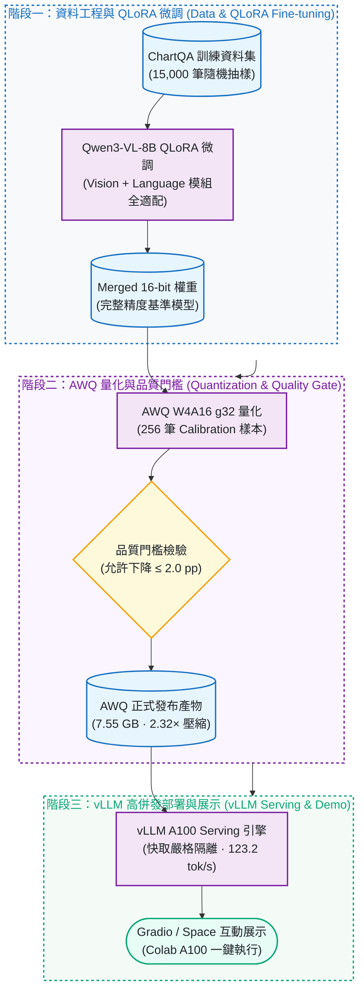

# Qwen3-VL ChartQA：QLoRA 微調、AWQ 量化與 vLLM 部署

[](https://github.com/kuotunyu/qwen3-vl-chartqa/actions/workflows/ci.yml)
[](https://github.com/kuotunyu/qwen3-vl-chartqa/releases/tag/v1.0.0)
[](https://huggingface.co/steven0226/qwen3vl-8b-chartqa-awq)
[](LICENSE)

[English](README.en.md)

本專案替需要部署視覺語言模型的人量出一件事：把圖表問答模型 Qwen3-VL-8B 壓成 4-bit 之後，答題準確率掉多少、服務速度快多少、代價在哪裡。

> Quantizing a fine-tuned Qwen3-VL-8B to AWQ W4A16 shrinks the weights from 17.53 GB to 7.55 GB and costs 0.72 pp of ChartQA accuracy (86.24% → 85.52%, inside a 2 pp tolerance set beforehand). On one A100 it is 83.2% faster at concurrency 1, but TTFT p95 gets worse at concurrency 4/8/16. The 15,000-example QLoRA fine-tune itself barely moved accuracy (+0.56 pp).


## 主要發現

- **量化幾乎不掉準確率**：AWQ W4A16 把權重從 17.53 GB 壓到 7.55 GB（2.32× 壓縮），ChartQA 完整 2,500 題的準確率由 86.24% 變為 85.52%（-0.72 pp），在事先訂好的 2 pp 容許範圍內。
- **速度的好處集中在低併發**：單張 A100 上，concurrency 1 的輸出吞吐量 +83.2%、TPOT p95 -51.9%；但 concurrency 4/8/16 的首 token 延遲（TTFT p95）反而變差（上圖中間）。
- **微調幾乎沒有帶來改善（+0.56 pp；human 子集 +0.16 pp）**：15,000 筆資料的 QLoRA 微調後，同一份 2,500 題為 84.68% → 85.24%。
- LoRA／Merged 16-bit／AWQ／GGUF 四種權重都已公開；本頁表格的數字由 `scripts/verify_claims.py` 對照 `assets/` 內的結果檔核對，CI 每次都會執行。

**連結**：[線上展示（Hugging Face Space，支援 Colab A100 一鍵啟動）](https://huggingface.co/spaces/steven0226/qwen3vl-chartqa-demo) · [AWQ 權重](https://huggingface.co/steven0226/qwen3vl-8b-chartqa-awq) · 其餘權重見 [模型產物](#模型產物)

離線核對本頁數字（不需 GPU、權重或資料集；首次安裝依賴可能需要網路）：

```bash
uv sync --frozen --python 3.12
uv run --offline --no-sync python scripts/verify_claims.py
uv run --offline --no-sync python -m unittest discover -s tests -v
```

---

## 運作方式



多格式產物如何對應到 vLLM、llama.cpp 與展示頁，見 [服務部署與多端推論架構圖](docs/architecture.md)。

---

## 結果

以下為歷史實驗結果；`scripts/verify_claims.py` 由 `assets/` 已存的逐題正誤旗標重算準確率，並核對下列三張表與衍生比例。

### 量化品質

Merged 16-bit 與 AWQ 於隔離 vLLM 程序中進行 2,500 題完整配對評估（事先訂定的容許上限：-2.0 pp）：

| Split | n | Merged 16-bit | AWQ W4A16 g32 | 變化 |
|---|---:|---:|---:|---:|
| Human | 1,250 | 77.28% | 76.56% | -0.72 pp |
| Augmented | 1,250 | 95.20% | 94.48% | -0.72 pp |
| Overall | 2,500 | 86.24% | **85.52%** | **-0.72 pp — PASS** |

權重檔由 17.53 GB 降至 7.55 GB，減少 56.9%（2.32× 壓縮）。品質門檻依點估計判定通過：下降 0.72 pp ≤ 2.0 pp。

### Serving benchmark

測試條件：單張 NVIDIA A100-SXM4-40GB、vLLM `0.25.1+cu129`、torch `2.11.0+cu129`（run `v2-aa4442870cfd`），模型與資料版本固定；每個併發等級 64 筆正式請求，每筆強制輸出 64 tokens（忽略 EOS，不代表自然短答長度）。8 組全部 64/64 成功並通過有效性檢查。**每組只有 64 requests，p95 為探索性指標**，不能推廣為其他硬體、版本或正式服務 SLA。

| 模型 | Concurrency | Output tok/s | TTFT p95 | TPOT p95 | E2E p95 |
|---|---:|---:|---:|---:|---:|
| Merged 16-bit | 1 | 67.29 | 160.76 ms | 13.43 ms/tok | 1,007.16 ms |
| AWQ W4A16 g32 | 1 | **123.24** | **154.81 ms** | **6.47 ms/tok** | **562.00 ms** |
| Merged 16-bit | 4 | 231.02 | **299.78 ms** | 15.04 ms/tok | 1,169.61 ms |
| AWQ W4A16 g32 | 4 | **356.95** | 326.64 ms | **9.11 ms/tok** | **776.13 ms** |
| Merged 16-bit | 8 | 387.58 | **473.68 ms** | 18.33 ms/tok | 1,426.90 ms |
| AWQ W4A16 g32 | 8 | **528.48** | 572.66 ms | **12.40 ms/tok** | **1,038.69 ms** |
| Merged 16-bit | 16 | 595.06 | **806.77 ms** | 24.14 ms/tok | 2,005.45 ms |
| AWQ W4A16 g32 | 16 | **701.90** | 958.28 ms | **19.93 ms/tok** | **1,612.51 ms** |

在這組固定負載下，相較於 Merged 16-bit，AWQ：

- 在 concurrency 1/4/8/16 的輸出吞吐量分別提升 83.2%／54.5%／36.4%／18.0%；
- TPOT p95 分別降低 51.9%／39.4%／32.4%／17.4%；E2E p95 分別降低 44.2%／33.6%／27.2%／19.6%；
- 代價是高併發 TTFT p95（c=4/8/16）增加 9.0%／20.9%／18.8%；是否可接受取決於首 token 延遲需求，本測試未證實退步的原因。

完整控制見 [benchmark 原表](assets/bench/benchmark_table.md) 及 [設計紀錄](docs/DESIGN_NOTES.md#serving-benchmark-design)。

### 微調前後

完整 2,500 題 ChartQA test set 配對評估：

| Split | n | 微調前 | 微調後 | 變化 |
|---|---:|---:|---:|---:|
| Human | 1,250 | 75.28% | 75.44% | +0.16 pp |
| Augmented | 1,250 | 94.08% | 95.04% | +0.96 pp |
| Overall | 2,500 | 84.68% | **85.24%** | **+0.56 pp** |

---

## 模型產物

| 產物 | 用途 | 規格與權重連結 |
|---|---|---|
| AWQ W4A16 g32 | 建議部署版本（2.32× 壓縮、高吞吐） | [Hugging Face 權重](https://huggingface.co/steven0226/qwen3vl-8b-chartqa-awq) |
| Merged 16-bit | 品質參考與 full-precision baseline | [Hugging Face 權重](https://huggingface.co/steven0226/qwen3vl-8b-chartqa-merged-16bit) |
| LoRA adapter | 訓練權重與 PEFT 模組 | [Hugging Face 權重](https://huggingface.co/steven0226/qwen3vl-8b-chartqa-lora) |
| GGUF Q4_K_M + Q8_0 mmproj | llama.cpp CPU 可攜式推論產物 | [Hugging Face 權重](https://huggingface.co/steven0226/qwen3vl-8b-chartqa-gguf) |

---

## 適用範圍與限制

- **兩組準確率不能串接**：85.24% 來自 [微調評測](assets/eval/results.json) 的 Unsloth／Transformers 4-bit base + LoRA；86.24% 來自 [量化評測](assets/eval_quant/results.json) 的 merged 16-bit／獨立 vLLM。對應 notebook 顯示兩者使用相同短答指令、最多 32 tokens，但影像處理、題目排序及推論堆疊不同；微調 run 未完整保存版本與執行設定，不能把兩者的 1.00 pp 差距歸因於某一因素，也不能串成連續提升。請分別解讀 **84.68→85.24** 與 **86.24→85.52**；詳見 [設定來源與未確認項目](docs/DESIGN_NOTES.md#evaluation-provenance-audit-2026-09-19)。
- **bootstrap 信賴區間無法重現**：歷史文件報告整體 AWQ 變化的 paired bootstrap 95% CI 為 `[-1.40, -0.04] pp`，但目前 repo 缺少該次 bootstrap 的 seed、重抽次數及可執行來源，離線檢查不驗證此區間。
- **無法做逐題失敗分析**：公開逐題檔只含 `idx`、`correct`（微調組另含 `query_sha256`），沒有預測、答案、題目或圖表；量化組也沒有 query hash，不能直接用相同 idx 跨兩種評測排序配對。因此只能重算正誤統計，無法可追溯地判斷 OCR、算術或圖例理解等失敗原因；這裡不挑圖代替分析，自製合成展示圖也不算模型成功案例。缺少的欄位與未來選例規則記在 [案例分析邊界](docs/DESIGN_NOTES.md#case-analysis-boundary)。
- **離線檢查的範圍**：`verify_claims.py` 通過代表已實作檢查的一致性；它不重新產生預測、不從原始答案重新評分，不涵蓋全部文字宣稱或實驗來源真實性，且不是每個證據檔都有已記錄的 hash。2026-09-19 的工作是離線文件／證據查核，未重跑歷史實驗。
- **訓練紀錄**：訓練耗時與 `train_loss` 不足以單獨證明收斂或泛化。

---

## 方法與工程控制

- **QLoRA 微調：** 使用 8-bit AdamW、peak lr `2e-4`、effective batch size 16，在 A100 上對 Qwen3-VL-8B 視覺與語言模組進行全適配微調。[訓練紀錄](assets/log_history.json) 顯示 1 epoch、938 steps、3,579 秒，run 摘要 `train_loss=0.5907`。
- **AWQ W4A16 量化：** group size 32，使用 256 筆校準樣本，保留 vision tower 與 `lm_head` 原始精度。
- **GGUF 匯出：** 生成 `Q4_K_M` 文字模型與 `Q8_0` 多模態 projector，通過獨立 CPU smoke test。
- **Benchmark 控制：** 關閉 processor／prefix cache、嚴格分離 warmup／measured 圖片、綁定單一實體 GPU，量測期間若出現 JIT 即判定該次量測無效。

---

## 資料與授權

- 本專案程式碼採 [MIT License](LICENSE) 授權。
- 第三方元件與資料集授權詳見 [THIRD_PARTY_NOTICES.md](THIRD_PARTY_NOTICES.md)。

## 延伸閱讀

- [設計紀錄：決策、評測來源查核、benchmark 設計與問答](docs/DESIGN_NOTES.md)
- [服務部署與多端推論架構圖](docs/architecture.md)
- [benchmark 原表](assets/bench/benchmark_table.md)
- 模型卡：[AWQ](docs/model_cards/awq.md)・[Merged 16-bit](docs/model_cards/merged-16bit.md)・[LoRA](docs/model_cards/lora.md)・[GGUF](docs/model_cards/gguf.md)
