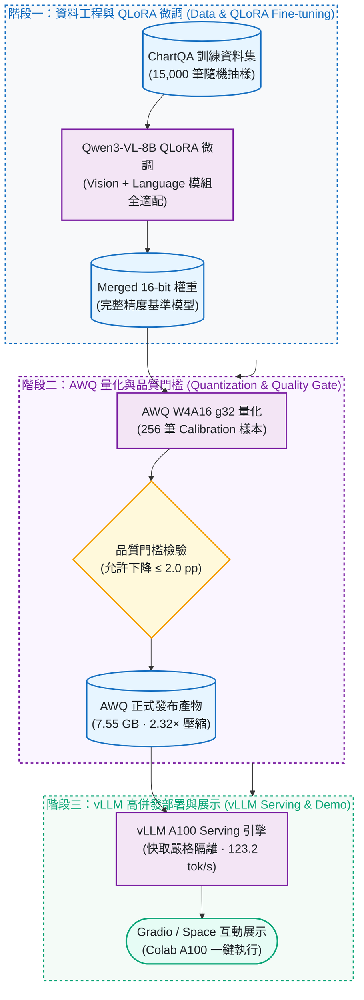
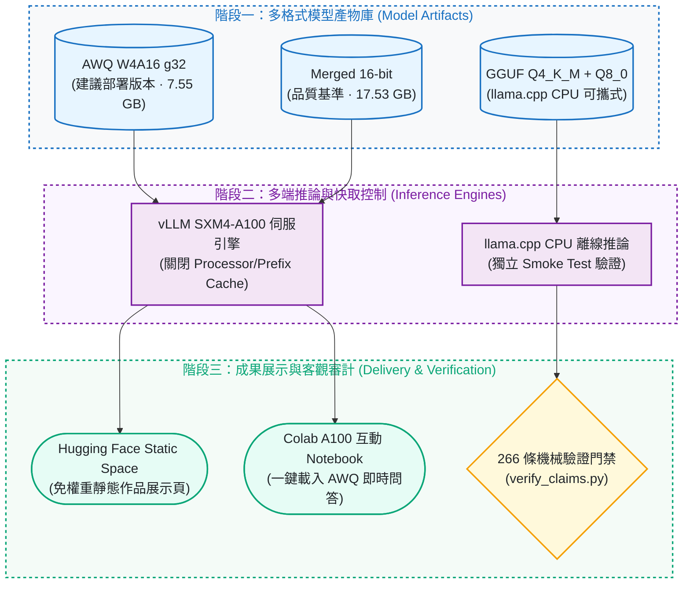

# Qwen3-VL ChartQA：QLoRA 微調、AWQ 量化與 vLLM 部署

[](https://github.com/kuotunyu/qwen3-vl-chartqa/actions/workflows/ci.yml)


[](LICENSE)

[English](README.md) · [→ 互動展示 (Hugging Face Space)](https://huggingface.co/spaces/steven0226/qwen3vl-chartqa-demo) · [→ 模型權重 (Hugging Face Hub)](https://huggingface.co/steven0226/qwen3vl-8b-chartqa-awq) · [→ 快速重現](#重現) · [→ 設計細節 (DESIGN_NOTES.md)](docs/DESIGN_NOTES.md)

這是一個完整的視覺語言模型生命週期作品：

`ChartQA 資料 → QLoRA 微調 → 配對正確率評估 → 合併 16-bit → AWQ W4A16 量化 → vLLM serving benchmark → Gradio demo`

專案以 15,000 筆 ChartQA 訓練 Qwen3-VL-8B-Instruct，使用完整 2,500 題 test set 驗證量化品質，再以同一張 A100、固定多模態 workload 公平比較 merged 16-bit 與 AWQ 的 serving 效能。

---

## 系統架構與 Pipeline

### 1. 視覺語言模型端到端生命週期 Pipeline



### 2. 服務部署與多端推論架構



---

## 目前狀態

規劃範圍已全部完成並進入 feature freeze。訓練、評估、量化、serving benchmark 與發布皆在 pinned revision 下各執行一次，並以機器可讀的證據封存。

- **建議部署產物：**[AWQ W4A16 g32](https://huggingface.co/steven0226/qwen3vl-8b-chartqa-awq) —— 通過品質門檻、體積縮小 2.32×，且在所有受測並發下都更快。
- **互動 demo：**由 [Static Space 作品頁](https://huggingface.co/spaces/steven0226/qwen3vl-chartqa-demo) 一鍵開啟的 Colab A100 notebook。Static Space 只呈現實證，**不會在瀏覽器內執行 8B 模型**。
- **Demo 驗收：**2026-07-16 於全新 Colab session 以 pinned AWQ revision 載入未加標註的原始 ChartQA 圖表，短答與分析模式皆正確。
- **GGUF：**`Q4_K_M` 模型與 `Q8_0` 多模態 projector 固定於 revision `5e5860f5d406`，並通過獨立 CPU smoke test。
- **未部署：**`space/` 內含完整且有單元測試的 CPU 推論服務（bounded queue、rate limit、health/readiness、metrics）。在 `cpu-basic` 上架 Gradio 或 Docker Space 需付費方案，因此從未啟動，**本專案不宣稱任何 OOD 或 soak 結果**。詳見 [DESIGN_NOTES.md](docs/DESIGN_NOTES.md#archived-cpu-inference-service-built-tested-never-deployed)。

本 repository 不重新散布 ChartQA，詳見[資料與授權](#資料與授權)。

---

## 模型產物

| 產物 | 用途 | Hugging Face |
|---|---|---|
| LoRA adapter | 訓練產物與 PEFT 重用 | [qwen3vl-8b-chartqa-lora](https://huggingface.co/steven0226/qwen3vl-8b-chartqa-lora) |
| Merged 16-bit | 品質參考與 serving baseline | [qwen3vl-8b-chartqa-merged-16bit](https://huggingface.co/steven0226/qwen3vl-8b-chartqa-merged-16bit) |
| AWQ W4A16 g32 | 建議部署版本 | [qwen3vl-8b-chartqa-awq](https://huggingface.co/steven0226/qwen3vl-8b-chartqa-awq) |
| GGUF Q4_K_M + Q8_0 mmproj | 可攜式 llama.cpp CPU 版本，已通過 smoke test | [qwen3vl-8b-chartqa-gguf](https://huggingface.co/steven0226/qwen3vl-8b-chartqa-gguf) |

持久專案展示：[Qwen3-VL ChartQA｜圖表理解工作台](https://huggingface.co/spaces/steven0226/qwen3vl-chartqa-demo)

---

## 正式結果

以下每個數字都會在每次 CI 由 `assets/` 內的證據重新算出：

```bash
python scripts/verify_claims.py
```

它會解析兩份 README 的表格、由逐題正確性重算每個準確率、由 benchmark JSON 重新推導壓縮與延遲變化、重新核對證據的 SHA-256 鏈，任何一項對不上就失敗。

| 宣稱 | 證據 |
|---|---|
| 微調準確率 | [`assets/eval/results.json`](assets/eval/results.json)、[`per_item_baseline.json`](assets/eval/per_item_baseline.json)、[`per_item_finetuned.json`](assets/eval/per_item_finetuned.json) |
| 量化品質門檻 | [`assets/eval_quant/results.json`](assets/eval_quant/results.json)、[`per_item_merged16_n1250.json`](assets/eval_quant/per_item_merged16_n1250.json)、[`per_item_awq_n1250.json`](assets/eval_quant/per_item_awq_n1250.json) |
| Serving benchmark | [`assets/bench/benchmark_results.json`](assets/bench/benchmark_results.json)、[`workload_manifest.json`](assets/bench/workload_manifest.json)、[`quality_gate_source.json`](assets/bench/quality_gate_source.json) |
| 量化配方 | [`assets/quantization_metadata.json`](assets/quantization_metadata.json)、[`assets/recipe.yaml`](assets/recipe.yaml) |
| 訓練過程 | [`assets/log_history.json`](assets/log_history.json)、[`assets/loss_curve.png`](assets/loss_curve.png) |

### 微調前後

完整 ChartQA test set 配對評估：

| Split | n | 微調前 | 微調後 | 變化 |
|---|---:|---:|---:|---:|
| Human | 1,250 | 75.28% | 75.44% | +0.16 pp |
| Augmented | 1,250 | 94.08% | 95.04% | +0.96 pp |
| Overall | 2,500 | 84.68% | **85.24%** | **+0.56 pp** |

### 量化品質門檻

merged 與 AWQ 以隔離的 vLLM subprocess 再做一次完整 2,500 題配對評估；允許最多下降 2 個百分點。

| Split | n | Merged 16-bit | AWQ W4A16 g32 | 變化 |
|---|---:|---:|---:|---:|
| Human | 1,250 | 77.28% | 76.56% | -0.72 pp |
| Augmented | 1,250 | 95.20% | 94.48% | -0.72 pp |
| Overall | 2,500 | 86.24% | **85.52%** | **-0.72 pp — PASS** |

整體 AWQ 變化的 paired bootstrap 95% CI 為 `[-1.40, -0.04] pp`，最差端仍在預先設定的 -2 pp 門檻內。

兩張 accuracy 表採用不同的成對評估 stack；只能在各自表內做配對比較，不應跨表解讀絕對分數差異。

### Serving benchmark

正式 Run ID 為 `v2-aa4442870cfd`。環境為單張 NVIDIA A100-SXM4-40GB、vLLM `0.25.1+cu129`；每個 level 64 筆正式請求、固定解碼 64 tokens。8 組皆為 64/64 成功、`failed=0`，並通過完整 validity gate。

| 模型 | Concurrency | Output tok/s | TTFT p95 | TPOT p95 | E2E p95 |
|---|---:|---:|---:|---:|---:|
| Merged 16-bit | 1 | 67.29 | 160.76 ms | 13.43 ms/tok | 1,007.16 ms |
| AWQ W4A16 g32 | 1 | **123.24** | **154.81 ms** | **6.47 ms/tok** | **562.00 ms** |
| Merged 16-bit | 4 | 231.02 | **299.78 ms** | 15.04 ms/tok | 1,169.61 ms |
| AWQ W4A16 g32 | 4 | **356.95** | 326.64 ms | **9.11 ms/tok** | **776.13 ms** |
| Merged 16-bit | 8 | 387.58 | **473.68 ms** | 18.33 ms/tok | 1,426.90 ms |
| AWQ W4A16 g32 | 8 | **528.48** | 572.66 ms | **12.40 ms/tok** | **1,038.69 ms** |
| Merged 16-bit | 16 | 595.06 | **806.77 ms** | 24.14 ms/tok | 2,005.45 ms |
| AWQ W4A16 g32 | 16 | **701.90** | 958.28 ms | **19.93 ms/tok** | **1,612.51 ms** |


相較 merged 16-bit，AWQ：

- 權重檔由 17.53 GB 降至 7.55 GB，減少 56.9%（2.32× 壓縮）；
- 在 concurrency 1/4/8/16 的輸出吞吐量分別提升 83.2%／54.5%／36.4%／18.0%；
- TPOT p95 分別降低 51.9%／39.4%／32.4%／17.4%；
- E2E p95 分別降低 44.2%／33.6%／27.2%／19.6%；
- 唯一明顯取捨是高併發 TTFT p95：c=4/8/16 分別增加 9.0%／20.9%／18.8%。

以本 workload 而言，c=4 適合重視回應性的多人互動，c=8 是吞吐與延遲的實用平衡；c=16 僅適合總吞吐優先、可接受較高 tail latency 的情境。

---

## 方法摘要

### QLoRA

- Base：`unsloth/Qwen3-VL-8B-Instruct-unsloth-bnb-4bit`
- 資料：ChartQA train 隨機抽樣 15,000 筆
- 1 epoch；max sequence length 2,048
- LoRA rank 16、alpha 16、dropout 0
- A100 effective batch size 16（4 × gradient accumulation 4）
- 8-bit AdamW、peak learning rate `2e-4`、linear schedule
- vision、language、attention 與 MLP 模組均開放 LoRA adaptation
- runtime 3,579 秒；final train loss 0.5907

### AWQ

- compressed-tensors W4A16；4-bit symmetric grouped weights；group size 32
- ChartQA calibration 256 筆；max calibration length 2,048
- vision tower 與 `lm_head` 保持原精度
- A100-SXM4-40GB 正式執行，`SMOKE_TEST=false`

### GGUF 匯出

- Revision：`5e5860f5d4060f87614ecfb6243a001067979276`
- Text model：`Qwen3VL-8B-ChartQA-Q4_K_M.gguf`（`5,027,784,800` bytes）
- 多模態 projector：`mmproj-Qwen3VL-8B-ChartQA-Q8_0.gguf`（`752,289,728` bytes）
- 使用 pinned llama.cpp 轉換，並以原始 ChartQA 圖表進行獨立 CPU smoke test；預期答案與模型輸出皆為 `96`

### 公平 benchmark 控制

- 四個 concurrency 共用同一組 32 human + 32 augmented 題目
- 所有 level 的 prompt 與圖片尺寸相同
- warmup／measured 圖分離；512 個 encoded 與 decoded-pixel hashes 全部唯一
- 關閉 multimodal processor cache 與 prefix cache
- 每 level 64 筆 warmup + 64 筆 measured，兩者皆固定輸出 64 tokens
- server process 隔離、模型與資料 revision 固定、綁定 GPU identity、正式量測期出現 JIT 即拒絕該結果
- 只有全部 validity checks 通過才發布 canonical report

更多細節請見 [設計紀錄](docs/DESIGN_NOTES.md) 與機器可讀的 [benchmark result](assets/bench/benchmark_results.json)。

---

## 重現

驗證已公開的宣稱 —— 純 CPU、離線、不需資料集與權重：

```bash
uv sync --python 3.12
uv run python scripts/verify_claims.py
uv run python -m unittest discover -s tests -v
```

確認逐題證據確實對應真實的 ChartQA test split（會下載 pinned dataset revision）：

```bash
uv sync --python 3.12 --extra data
uv run --extra data python scripts/verify_dataset_alignment.py
```

本機資料與 template smoke test：

```bash
uv run python -m unittest tests.test_template -v
uv run python scripts/test_data_pipeline.py --dataset-dir data/ChartQA --smoke
```

---

## 專案結構

```text
configs/          訓練、量化與 benchmark 設定檔
src/              核心推論、評估與服務邏輯
scripts/          端到端執行腳本與 266 條宣稱驗證器
assets/           機器可讀實證（評估 JSON、benchmark JSON、圖表）
demo/             Gradio 互動展示介面
space/            獨立 CPU 推論服務（未部署）
space_static/     Hugging Face 靜態作品展示頁原始碼
notebooks/        Colab A100 訓練、量化與評估 Notebook
tests/            單元測試與合約測試套件
```

---

## 資料與授權

- 本專案程式碼採 [MIT License](LICENSE) 授權。
- 第三方元件、資料集授權與版權聲明詳見 [THIRD_PARTY_NOTICES.md](THIRD_PARTY_NOTICES.md)。
