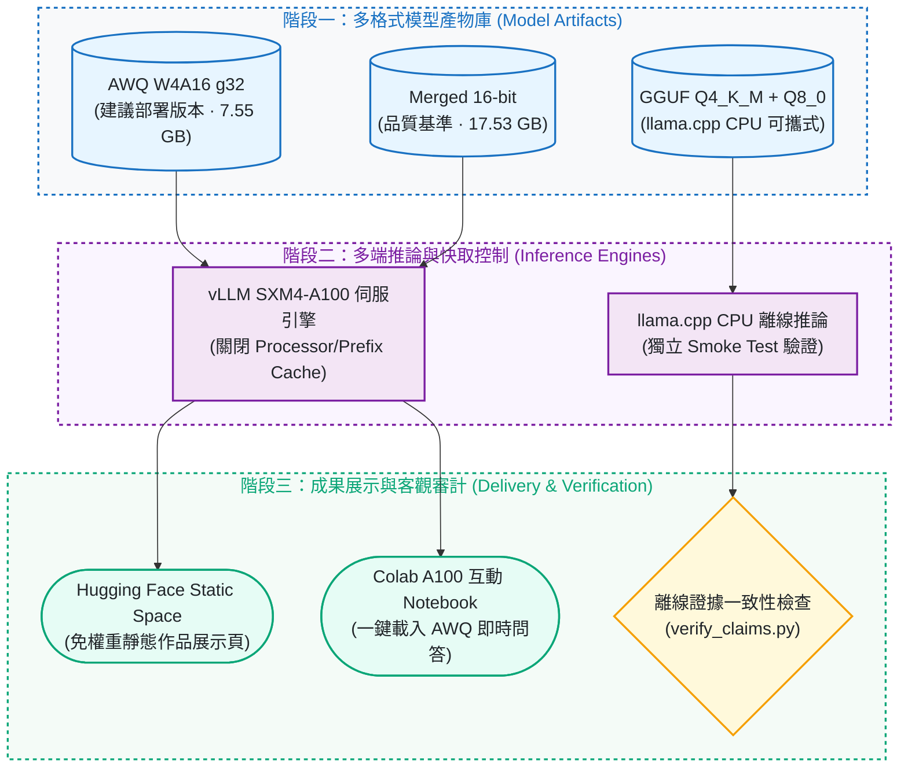
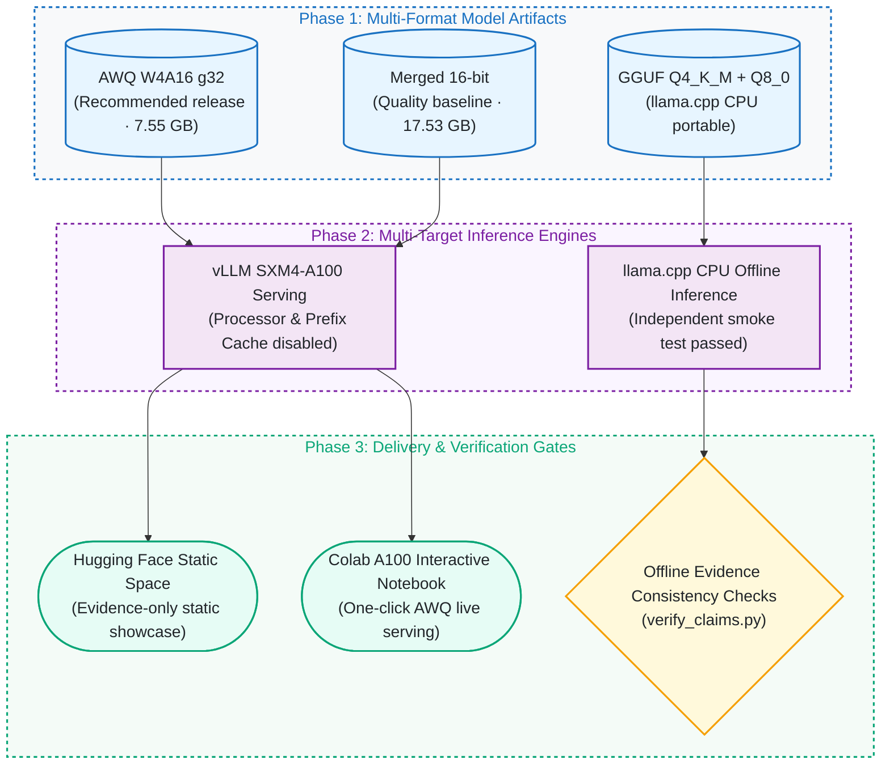

# 服務部署與多端推論架構 / Multi-Target Serving Architecture

這張圖原本放在 README，說明公開的多格式權重如何對應到各推論引擎與展示方式。端到端的訓練→量化→部署流程圖留在 [README](../README.md#運作方式)。

This diagram used to live in the README. It shows how the published weight formats map onto the inference engines and showcase pages. The end-to-end train → quantize → serve pipeline stays in the [README](../README.en.md#how-it-works).

## 服務部署與多端推論架構

## Multi-Target Serving Architecture

